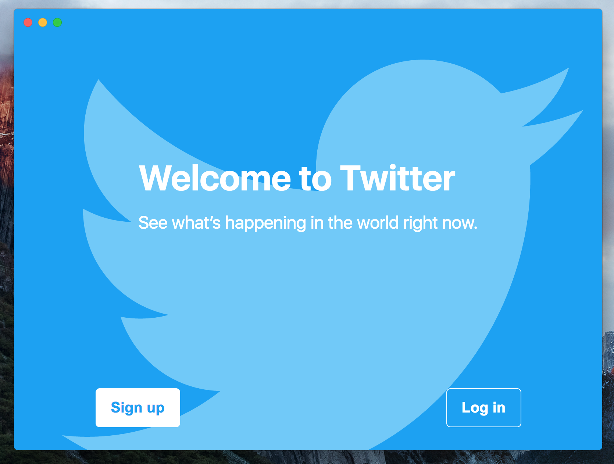
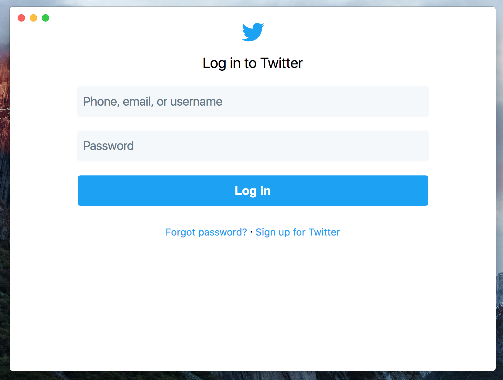

# Electrify
> Scaffolding Tool for turning websites into native desktop apps using electron.

Electrify is a Command Line Tool that creates a project with everything you need to make a themable desktop app from a website like [caprine](https://github.com/sindresorhus/caprine) or [ramme](https://github.com/terkelg/ramme).

<br>

## Installation
`npm install --global electrifyjs`.

<br>

## Creating a Project
Open your terminal in your desired project folder and run:

`electrify`

Electrify will prompt you for the following things:
  + Website URL: The URL of the website you wish to electrify.

  + User Agent: The User Agent you want the website to be requested with. *(defaults to a multi-browser mobile one)*.

  + App Name: The name of your app.

  + App Description: For the package.json field.

  + Author: For the package.json field.

  + License: For the package.json field.

  + Version: For the package.json field.

  + Github Repo: For deploying to github releases and auto updating. *(format: username/repo)*.

  + Github Access Token: For deploying to github releases and auto updating.

  + App ID: For the Mac build *(e.g.: com.yourapp.yourname)*.

  + App Category: For the Mac build *(e.g.: public.app-category.developer-tools)*.

This will create all the needed files and configuration to run a site as a native app.

To try it out run `yarn && yarn build:all && yarn start:electron`.

## Example:
```bash
cd tweetron
electrify
Website URL: https://twitter.com
User Agent(default):
App Name: tweetron
App Description: A nice app.
Author: You
License: MIT
Version: 1.0.0
Github Repo (username/repo): yourusername/yourrepo
Github Access Token: secret
App ID: yourid
App Category: yourappcategory
```
<p align="center">
  
  
</p>

<br>

## The NPM Scripts
  + `lint` - Lints js and sass files.

  + `start:babel` - Compiles and watches the js files.

  + `start:sass` - Compiles and watches the sass files.

  + `start:electron` - Starts the app in dev mode.

  + `start` - Starts all the `start:` tasks in parallel.

  + `clean` - Deletes the compiled and/or packaged output.

  + `build:all` - Compiles js and sass files.

  + `build` - Cleans, lints, and compiles all files for production.

  + `pack` - Runs `build` and packs the app for debugging.

  + `dist` - Runs `build` and packs the app for production.

  + `dist:release` - Same as `dist`, but uploads to github releases.

<br>

## How it Works
All the styles in `src/renderer/styles/index.scss` will be loaded when the dom is ready so you can override the website's styles.

The `src/renderer/index.js` will also be loaded when the dom is ready.

In the `src/main` folder you'll find the following files:

  + `app-menu.js`: Creates and attaches a menu bar.
  + `auto-updater.js`: Configures and initializes the auto updater.
  + `config.js`: Initializes the persistent config storage.
  + `windows.js`: Creates windows and adds listeners to their events.
  + `index.js`: Initializes the main process.

<br>

## Theming
The project comes with a sass themes mixin and ipc communication between the main and renderer processes to write the current theme to persistent storage and respond to menu bar button clicks.

You can add new themes or theme variables like so:
  1. In `src/renderer/styles/themes/_themes.scss`, add properties to the existing themes or create new ones.
  2. If you are adding new themes make sure to add them to edit `src/main/app-menu.js`. You'll want to add an entry to the submenu array of the menu item labeled `Theme`.

  `{ label: 'yourtheme', type: 'radio' }`

  3. To use the write scss like this:
  ```scss
  body {
    @include themify {
      background: theme(your-background-name);
    }
  }
  ```
  Now when you change the theme in the menu bar you should see the results.
